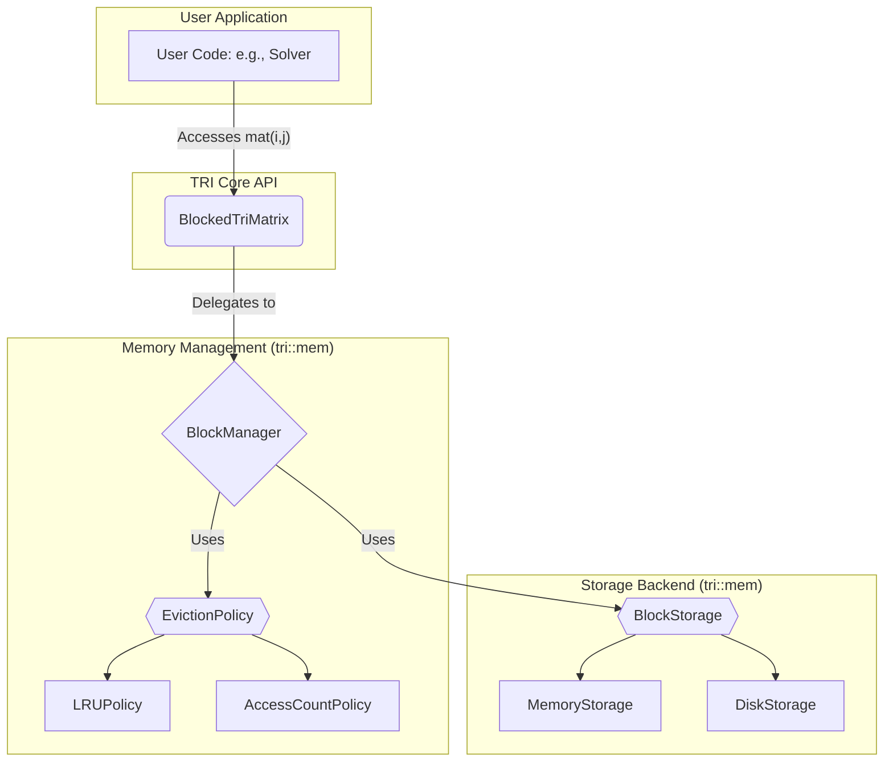

# TRI: a Tiled, performance-Resilient Infrastructure for large-scale matrix algebra

[](https://github.com/YongzeYang/TRI)
[](https://opensource.org/licenses/Apache-2.0)
[](https://github.com/YongzeYang/TRI)
[](https://isocpp.org/std/the-standard)

TRI is a high-performance C++ library for out-of-core linear algebra, specifically engineered for scientific and engineering computations involving extremely large triangular matrices.

## Overview

Modern scientific computing, from finite element analysis to large-scale machine learning, frequently involves matrices that exceed the available system RAM. Traditional linear algebra libraries require datasets to fit entirely in memory, creating a "memory wall" that forces users onto expensive high-performance computing (HPC) clusters or complex distributed frameworks.

TRI was created to address this fundamental challenge. It provides a robust, out-of-core computing framework that allows a standard engineering workstation to process matrices far larger than its physical memory. By intelligently virtualizing system resources and treating high-speed local storage (SSD/NVMe) as a seamless extension of RAM, TRI empowers researchers and engineers to tackle terabyte-scale problems on their local machines, dramatically reducing computational costs and infrastructure complexity.

## Key Features

This table highlights TRI’s unique features versus several well-known libraries.

| **Feature** | **TRI** | **Eigen** | **Armadillo** | **Intel MKL** |
| :--- | :--- | :--- | :--- | :--- |
| **Matrix Types & Storage** | • Dense, packed lower-triangular, and **block-based** triangular matrices | • Dense & sparse (standard storage formats) | • Dense & sparse (standard storage formats) | • Standard dense/sparse BLAS/LAPACK formats; not specialized |
| **Memory Management & Caching** | • Advanced block manager with **configurable eviction** (LRU, AccessCount) | • In-memory only (no built-in block caching) | • In-memory only | • Highly optimized routines, but no dynamic cache management |
| **Hybrid Storage Options** | • Supports **hybrid (memory + disk) storage** for out-of-core matrices | • No built-in support for disk backing | • No inherent disk‐based storage | • Computations run in memory; external I/O required |
| **Matrix Factory Interfaces** | • Extensive factory functions (identity, zeros, random, diagonal, etc.) | • Provides basic constructors and helper functions | • Basic factory routines available | • Not applicable (low-level BLAS/LAPACK routines) |
| **Caching for Large-Scale Problems** | • Optimized for huge matrices via **block-level caching** and eviction policies | • Optimized for small/medium problems; less focus on memory pressure | • Performance relies on underlying BLAS/LAPACK; not block‐oriented | • Best-case performance on supported hardware (all operations in-memory) |
| **Extensibility & Customization** | • Highly modular design with **pluggable eviction policies** and storage backends | • Extensible expression framework, but limited in memory mgmt. | • Extensible in terms of algorithms; memory mgmt is fixed | • Proprietary and highly tuned; customization is limited |
| **Thread Safety & Concurrency** | • Optional thread-safe operations in `BlockManager` with mutex support | • Supports parallelism if used carefully | • Generally thread-safe if underlying BLAS is multi-threaded | • Optimized for multi-threading, but not directly extensible |

---

**Key Advantages of TRI:**
*   **Advanced Block-Level Memory Management:** TRI provides configurable eviction policies and hybrid storage, making it well-suited for extremely large matrices and memory-constrained environments.
*   **Specialized Matrix Storage Formats:** The block-based implementation for triangular matrices improves cache locality and computational efficiency for relevant algorithms.
*   **Modular & Extensible Design:** With pluggable factories, eviction policies, and storage backends, TRI is designed for future extension and customization beyond traditional dense libraries.

## Repository Structure

The repository is organized into a modular structure to promote clarity, maintainability, and ease of contribution.

```
TRI/
├── cmake/               # CMake helper scripts and package configuration
├── include/             # The public API (headers)
│   └── tri/
│       ├── blas/        # Low-level BLAS/LAPACK abstractions
│       ├── common/      # Shared utilities (macros, configs, types)
│       ├── core/        # Core matrix data structures
│       ├── factory/     # Factory classes for matrix creation
│       ├── linalg/      # High-level linear algebra algorithms
│       └── mem/         # The out-of-core memory management engine
├── src/                 # Source file implementations
│   └── tri/             # (Mirrors the include/tri structure)
├── tests/               # Unit and integration tests
│   ├── framework/     # Custom test runner and assertion tools
│   ├── fixtures/      # Reusable test data and setups
│   ├── integration/   # Tests for component interoperability
│   └── unit/          # Tests for individual components
└── examples/            # Standalone usage examples
```

-   **/include/tri**: The public API of the library. All headers required to use TRI are located here. Its subdirectories represent the core modules of the library:
    -   **`core/`**: Defines the fundamental matrix data structures, including `DenseRM`, `LowerTriangularRM`, and the flagship `BlockedTriMatrix`.
    -   **`mem/`**: The heart of the out-of-core engine. This module contains the entire memory management system, including the `BlockManager`, pluggable `EvictionPolicy` strategies, and `BlockStorage` backends.
    -   **`blas/`**: Provides thin, efficient wrappers over high-performance BLAS/LAPACK routines.
    -   **`linalg/`**: Implements higher-level linear algebra algorithms (e.g., Cholesky, solvers) that utilize the core data structures.
    -   **`factory/`**: Contains convenience factories for easy instantiation of different matrix types.

-   **/src**: Contains the source (`.cpp`) implementations for the functionality declared in the header files. The directory structure here mirrors `/include` to ensure logical consistency.

-   **/tests**: A comprehensive suite of unit and integration tests built using a lightweight internal framework. The structure of `/tests/unit` mirrors the source tree, ensuring clear test organization and high code coverage.

-   **/examples**: Contains standalone, minimal examples that demonstrate how to use the library's key features.

-   **/cmake**: Holds helper scripts for the CMake build system, including package configuration files for `find_package` and the uninstall logic.

## Architecture

TRI is designed with modularity, extensibility, and clean separation of concerns as its guiding principles. The architecture allows for independent evolution of the data structures, memory management logic, and storage backends.



1.  The **User Code** interacts with the `BlockedTriMatrix` via a simple, high-level API.
2.  `BlockedTriMatrix` translates element access into block-level requests and delegates them to the **BlockManager**.
3.  The **BlockManager** is the scheduling brain. It checks if a block is in its managed cache.
    - If not, it requests the **BlockStorage** backend to load the data.
    - If the cache is full, it consults the **EvictionPolicy** to select a victim block to evict.
4.  The **EvictionPolicy** (e.g., `LRUPolicy`) and **BlockStorage** (e.g., `DiskStorage`) are abstract interfaces, allowing for custom implementations.

## Installation

### Prerequisites

*   A C++17 compliant compiler (e.g., GCC 9+, Clang 10+)
*   CMake (version 3.14 or later)
*   (Recommended) OpenBLAS and LAPACKE development libraries for optimal performance.

### Build Instructions

The project uses a standard CMake build process.

```bash
# 1. Clone the repository
git clone https://github.com/YongzeYang/TRI.git
cd TRI

# 2. Configure the build
mkdir build && cd build
# Basic build
cmake ..
# Or, build with tests and examples
cmake .. -DTRI_BUILD_TESTS=ON -DTRI_BUILD_EXAMPLES=ON

# 3. Compile the library
make -j$(nproc)

# 4. (Optional) Run tests to verify the build
ctest

# 5. (Optional) Install the library system-wide
sudo make install
```

## Quick Start

The following example demonstrates the power of TRI's out-of-core computation. We will create a 10,000 x 10,000 matrix (approx. 400 MB of data if dense) but configure the cache to hold only 10 blocks (a tiny fraction of the total data), forcing the library to use the disk.

Create a file named `quick_start.cpp`:
```cpp
#include <iostream>
#include <string>
#include <vector>
#include <filesystem>
#include "tri/core/blocked_tri.hpp"
#include "tri/mem/block_manager.hpp"
#include "tri/mem/block_storage.hpp"

int main() {
    const std::size_t n = 10000;
    const std::size_t block_size = 256;
    const std::size_t max_memory_blocks = 10; // Extremely limited memory cache

    // Define a temporary directory for disk storage
    std::string temp_dir = "./tri_storage";
    std::filesystem::create_directory(temp_dir);

    std::cout << "Creating a virtual " << n << "x" << n << " matrix..." << std::endl;
    tri::core::BlockedTriMatrix<double> mat(n, block_size);

    // 1. Set the storage backend to use the disk for evicted blocks
    mat.set_storage_backend(tri::core::BlockedTriMatrix<double>::StorageType::Disk, temp_dir);

    // 2. Create and attach a block manager with a small memory limit
    mat.create_block_manager(max_memory_blocks, "LRU");

    std::cout << "Cache limit: " << max_memory_blocks << " blocks in RAM." << std::endl;
    std::cout << "Filling matrix. This will force blocks to be written to and read from disk." << std::endl;

    // 3. Fill the matrix. The API is simple, TRI handles all I/O.
    for (std::size_t i = 0; i < n; ++i) {
        for (std::size_t j = 0; j <= i; ++j) {
            mat(i, j) = static_cast<double>(i + j);
        }
    }

    // 4. Verify a value to prove data persistence
    double expected_value = static_cast<double>((n - 1) + (n / 2));
    double actual_value = mat(n - 1, n / 2);
    std::cout << "Verification: mat(9999, 5000) = " << actual_value << " (Expected: " << expected_value << ")" << std::endl;

    // 5. Print statistics from the block manager
    if (auto manager = mat.get_block_manager()) {
        auto stats = manager->get_stats();
        std::cout << "\n--- Cache Statistics ---" << std::endl;
        std::cout << "Total Loads (from disk): " << stats.total_loads << std::endl;
        std::cout << "Total Evictions (to disk): " << stats.total_evictions << std::endl;
        std::cout << "Cache Hits: " << stats.cache_hits << std::endl;
        std::cout << "Cache Misses: " << stats.cache_misses << std::endl;
        std::cout << "Hit Rate: " << stats.hit_rate() * 100.0 << "%" << std::endl;
    }

    // Cleanup
    std::filesystem::remove_all(temp_dir);
    
    return 0;
}
```
To compile and run this example, use the following `CMakeLists.txt` in the same directory:
```cmake
cmake_minimum_required(VERSION 3.14)
project(QuickStart)

set(CMAKE_CXX_STANDARD 17)
set(CMAKE_CXX_STANDARD_REQUIRED ON)

find_package(TRI REQUIRED)

add_executable(quick_start quick_start.cpp)
target_link_libraries(quick_start PRIVATE TRI::tri_static)
```
Then compile and run:
```bash
# Assuming you are in the build directory from the main installation
cmake /path/to/your/quickstart/directory
make
./quick_start
```

## Benchmarks

Detailed performance benchmarks are currently being compiled and will be published here shortly. The planned benchmarks will demonstrate:
*   A direct comparison of TRI's runtime and peak memory usage versus traditional in-memory libraries when processing datasets that exceed physical RAM.
*   The performance impact of different `EvictionPolicy` choices (`LRU` vs. `AccessCount`) on common linear algebra algorithms.
*   Scalability analysis as the matrix size grows from in-memory to significantly out-of-core dimensions.

## Roadmap

TRI is under active development. The flexible architecture paves the way for several exciting future enhancements:

*   **Cloud & Distributed Storage Backends:** Implementing `BlockStorage` for cloud services like Amazon S3 or distributed file systems like HDFS.
*   **On-Disk Compression:** Integrating compression libraries (e.g., ZSTD, LZ4) into the `DiskStorage` backend to reduce the storage footprint and I/O bandwidth requirements.
*   **Heterogeneous Computing Support:** Extending the `BlockManager` to manage data blocks across different memory spaces, such as CPU RAM and GPU VRAM, for out-of-core GPU computing.

## Contributing

Contributions are welcome and highly valued. Please follow the standard GitHub workflow:

1.  Fork the repository.
2.  Create a new branch for your feature or bug fix (`git checkout -b feature/my-new-feature`).
3.  Commit your changes.
4.  Push to your branch (`git push origin feature/my-new-feature`).
5.  Create a new Pull Request.

For bug reports and feature requests, please open an issue on GitHub.

## License

This project is licensed under the [Apache License 2.0](LICENSE).
